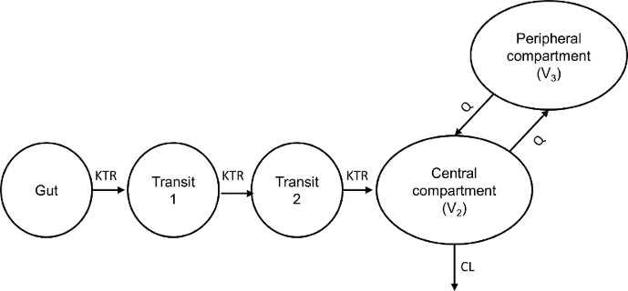

## Introduction 
  ADVAN-style analytical solutions for 1, 2, 3 compartment linear pharmacokinetic models of intravenous bolus, infusion,
and first-order absorption have been derived and published by [Abuhelwa et al., 2015](http://www.ncbi.nlm.nih.gov/pubmed/25841670) [^1]. The analytical solutions are used to simulate the time-course of drug amounts in the compartments of a pharmacokinetic models and they “advance” the solution of the model from one time point to the next, allowing for any dose or time-varying covariate factors to be accounted for. The ADVAN-style analytical solutions were coded in the R programming language [^2] and have been shown to have speed advantages over solutions using differential equation solvers [1]. 

## Aims
The aims of this work were to:

  - Enhance the computational speed of the ADVAN-style analytical functions through coding them in hybrid R/C++ programming languages for faster simulation processing.

  - Present the ADVAN-style analytical functions in an R package, **PKADVAN package** and make them available for the wider audience.
  
  - Expand the “PKADVAN” package library to include other pharmacokinetic models such as transit first-order absorption and metabolite models.

## Methods
  - The ADVAN-style analytical solutions were derived using Laplace transforms and then were coded in the C++ programming language and integrated into R using the Rcpp package attributes [^3].
  
  - The integrated R/C++ ADVAN-style analytical functions were built into an open-source R package (“PKADVAN” package). 
  
  - To assess computational speed, simulations for 1000 subjects using three compartment IV bolus, infusion, and first-order absorption models were performed and compared to relative computational speed of the equivalent R-coded functions. For each subject, two doses were simulated with the evaluations performed at 1 hour time intervals for 2 days.
  
  - All pharmacokinetic models incorporated into the PKADVAN package have been validated against the commercially available population pharmacokinetic modelling software NONMEM.

## PKADVAN package
  - A total of 26 pharmacokinetic models were incorporated into the [PKADVAN package](https://github.com/abuhelwa/PKADVAN_Rpackage) library including the basic models published by Abuhelwa et al [1]. A list of all the models is presented in Table 1. 

  - To perform pharmacokinetic simulations using the “PKADVAN” package, two simple steps are required: (1) Supply a NONMEM-style simulation data frame with the individual pharmacokinetic parameters including any covariate effects on the PK parameters (2) Call the “PKADVAN” function of the respective model to process simulations.

  - The NONMEM-style data frame should have the following columns: ID, TIME, AMT, in addition to the individual pharmacokinetic parameters of the respective pharmacokinetic model (e.g., CL, V, Q).
The PKADVAN functions returns the drug amounts in the respective compartments and the individual predicted concentrations (IPRED) in the central compartment of the pharmacokinetic system.
  
  - The PKADVAN functions are capable of simulating arbitrary dosing regimens and can account for time-changing covariate structures; however, covariate effects on respective parameters must be calculated prior processing simulations.

  - All the PKADVAN functions were validated against NONMEM and both outputs were identical. 
Stochastic population pharmacokinetic model simulations using the PKADVAN functions are comparable to NONMEM. An example output using PKADVAN package versus NONMEM is presented in Figure 1. The R-script for processing the simulations presented in Figure 1 is provided [here](https://github.com/abuhelwa/PKADVAN_Rpackage/tree/master/WCOP2016PKexample).

  - The “PKADVAN” package is available on GitHub and can be downloaded by clicking [here](https://github.com/abuhelwa/PKADVAN_Rpackage). 
  
  - Users are encouraged to read the package documentation and run the  simulation examples provided with the package.
  
  - Simulations using the integrated R/C++ ADVAN-style analytical solutions were substantially faster (8‑34 times) than the equivalent R-coded functions (Table 2). The relative speed of the integrated R/C++ functions was greater with the more complex models and with more extensive sample time evaluations (Table 2). 
  
  
######Table 1: Pharmacokinetic models of the 'PKADVAN' library
  Category            | Pharmacokinetic model             |     PKADVAN function name
--------------------------  | ----------------------------               | -------------------------
Basic PK models     | 1 comp IV bolus                     | `OneCompIVbolus`
Basic PK models     | 2 comp IV bolus                     | `TwoCompIVbolus`
Basic PK models     | 3 comp IV bolus                     | `ThreeCompIVbolus`
Basic PK models     | 1 comp IV infusion                  | `OneCompIVinfusion`
Basic PK models     | 2 comp IV infusion                  | `TwoCompIVinfusion`
Basic PK models     | 3 comp IV infusion                  | `ThreeCompIVinfusion`
Basic PK models     | 1 comp first-order absorption       | `OneCompFirstOrderAbs`
Basic PK models     | 2 comp first-order absorption       | `TwoCompFirstOrderAbs`
Basic PK models     | 3 comp first-order absorption       | `ThreeCompFirstOrderAbs`
Transit first-order absorption models     | 1 comp-1 transit        | `OneCompOneTransit`
Transit first-order absorption models     | 1 comp-2 transit				| `OneCompTwoTransit`
Transit first-order absorption models     | 1 comp-3 transit				| `OneCompThreeTransit`
Transit first-order absorption models     | 1 comp-4 transit        | `OneCompFourTransit`
Transit first-order absorption models     | 2 comp-1 transit        | `TwoCompOneTransit`
Transit first-order absorption models     | 2 comp-2 transit  			| `TwoCompTwoTransit`
Transit first-order absorption models     | 2 comp-3 transit  			| `TwoCompThreeTransit`
Transit first-order absorption models     | 2 comp-4 transit        | `TwoCompFourTransit`
First-order formation metabolite models   | 1 comp IV bolus-1 comp metabolite	    | `OneCompIVbolusOneCompMetab`
First-order formation metabolite models   | 2 comp IV bolus-1 comp metabolite   	| `TwoCompIVbolusOneCompMetab`
First-order formation metabolite models   | 3 comp IV bolus-1 comp metabolite	    | `ThreeCompIVbolusOneCompMetab`
First-order formation metabolite models   | 1 comp IV infusion-1 comp metabolite  | `OneCompIVinfusionOneCompMetab`
First-order formation metabolite models   | 2 comp IV infusion-1 comp metabolite  | `TwoCompIVinfusionOneCompMetab`
First-order formation metabolite models   | 3 comp IV infusion-1 comp metabolite  | `ThreeCompIVinfusionOneCompMetab`
First-order formation metabolite models   | 1 comp first-order absorption-1 comp metabolite	| `OneCompFirstOrderAbsOneCompMetab`
First-order formation metabolite models   | 2 comp first-order absorption-1 comp metabolite	| `TwoCompFirstOrderAbsOneCompMetab`
First-order formation metabolite models   | 3 comp first-order absorption-1 comp metabolite	| `ThreeCompFirstOrderAbsOneCompMetab`

######Table2: Comparison of computation time: R-functions versus the integrated R/C++ PKADVAN functions
Pharmacokinetic model           | R-functions (seconds)^a^ | PKADVAN functions (seconds)^a^ | Relative speed
-------------------------------    | ----------              | ----------------            |---------
3 comp IV bolus                 | 20.37 &plusmn; 0.08     | 1.33 &plusmn; 0.02          | 15.32
3 comp first-order absorption   | 26.70 &plusmn; 0.42     | 1.52 &plusmn; 0.01          | 17.57
3 comp IV-infusion              | 61.42 &plusmn; 0.17     | 5.04 &plusmn; 0.05          | 12.19
3 comp first-order absorption-extended^b^ |64.67 &plusmn; 0.17 | 1.90 &plusmn; 0.02        | 33.98

^a^ Mean ± SD computation time required to process simulations for 1000 subjects based on three compartment intravenous bolus, infusion, and first-order absorption models. For each subject, two doses were simulated with the evaluations performed at 1 hour time intervals for 2 days.

^b^ The same dosing regimen simulations extended for 5 days.

<br><br>


  

## Simulation Example
The following example illustrates the use of **PKADVAN** package to simulate the concentartion-time profiles of 1,000 subjects based on two compartment-two transit first-order oral absorption model. Creatinine clearance was added as a time-changing covariate on central clearance to show the cabability of the package in handling time-changing covariates. Between subject variability was added on `CL`, `V2`, `Q`, `V3`, `KA`. Proportional and additive residual error model was added on the individual predictions.

<br>

  

### Step 1: Generate a NONMEM-style data frame
If you have a NONMEM-style data frame then load it into R and skip this step, otherwise, use R to generate a simulation data frame.
```{r}
rm(list=ls(all=TRUE))
	graphics.off()

#load packages
	library(PKADVAN)
	library(plyr)
	library(ggplot2)
	
#Function for 90% confidence intervals calculation
	CI90lo <- function(x) quantile(x, probs=0.05,na.rm=T)
	CI90hi <- function(x) quantile(x, probs=0.95,na.rm=T)

#-----------------------------------------------
# Generate a NONMEM-style simulation data frame
#-----------------------------------------------
	#Set dose records: It can be arbitrary.
	dosetimes <- c(seq(0,48,12))
	tlast <- 96
	
	#Now define finer sample times for after a dose to capture Cmax
	doseseq <- c(0,0.5,1,1.5,2,2.5,3,3.5,4,4.5,5,5.5,6,7,8,9,10)
	
	#Use the outer product but with addition to expand this doseseq for all dosetimes
	PKtimes <- outer(dosetimes,doseseq,"+")
	
	#set number of subjects
	nsub <- 1000
	ID <- 1:nsub
	
	#Make dataframe
	df <- expand.grid("ID"=ID,"TIME"=sort(unique(c(seq(0,tlast,1),PKtimes))),"AMT"=0,"MDV"=0,"DV"=NA,"CLCR"=120)
	
	df$CLCR[df$TIME >= 36] <- 80  #Allow CLCR to change
	
	doserows <- subset(df, TIME%in%dosetimes)
	
	#Dose: It can be any arbitrary dose
	doserows$AMT <- 500
	doserows$MDV <- 1
	
	#Add back dose information
	df <- rbind(df,doserows)
	df <- df[order(df$ID,df$TIME,df$AMT),]       # arrange df by TIME (ascending) and by AMT (descending)
	df <- subset(df, (TIME==0 & AMT==0)==F) # remove the row that has a TIME=0 and AMT=0
	head(df)
```
### Step 2: Define parameters of the pharmacokinetic model
This includes setting population PK parameters, between subject variability, and residual error model parameters.
```{r}
#----------------------------------------------------------------------------
# Two compartment-2 transit first-order absorption model via PKADVAN package
#----------------------------------------------------------------------------
#Define between subject variability on PK parameters
	#BSV (Omegas as SD)
	ETA1CL  <- 0.15     
	ETA2V2  <- 0.12		
	ETA3Q   <- 0.14		
	ETA4V3  <- 0.05		
	ETA5KTR <- 0.30    

#Define residual error model
	#Residuals (Epsilons as SD)
	EPS1	<- 0.10		#Proportional residual error
	EPS2	<- 0.15		#Additive residual error

	#Use random number generator to simulate residuals from a normal distribution    
	BSVCL	<- rnorm(nsub, mean = 0, sd = ETA1CL)	#BSV on CL  
	BSVV2	<- rnorm(nsub, mean = 0, sd = ETA2V2)	#BSV on V2  
	BSVQ	<- rnorm(nsub, mean = 0, sd = ETA3Q)	#BSV on Q
	BSVV3	<- rnorm(nsub, mean = 0, sd = ETA4V3)	#BSV on V3
	BSVKTR	<- rnorm(nsub, mean = 0, sd = ETA5KTR)  #BSV on KTR

	EPS1 <- rnorm(nsub, mean = 0, sd = EPS1)	#Proportional residual error
	EPS2 <- rnorm(nsub, mean = 0, sd = EPS2)	#Additive residual error
	
#Set population PK parameters for 2-compartment First-order absorption model
	CLpop   <- 0.5      #central clearance
	V2pop   <- 20       #central volume of distribution
	Qpop    <- 1        #inter-compartmental clearance
	V3pop   <- 25       #peripheral volume of distribution
	KTRpop  <- 2.05     #first-order absorption rate constant
	F1pop   <- 0.80     #Bioavailability

```
### Step 3: Modify the simulation data frame for PKADVAN calculation and include any covariates on the PK parameters
```{r}
inputDataFrame <- df
#Calculate group parameter values including any covariate effects
	inputDataFrame$CL  <- CLpop*exp(BSVCL)*(inputDataFrame$CLCR/100)   #creatinine clearance added as a time-changing covariate on CL
	inputDataFrame$V2  <- V2pop*exp(BSVV2)
	inputDataFrame$Q   <- Qpop*exp(BSVQ)
	inputDataFrame$V3  <- V3pop*exp(BSVV3)
	inputDataFrame$KTR <- KTRpop*exp(BSVKTR)
	inputDataFrame$F1  <- F1pop
	head(inputDataFrame)
```
### Step 4: Apply PKADVAN function of the selected PK model
To simulate a population (i.e. the `inputDataFrame` has more than one subject `ID`), the function has to be applied for each subject `ID`. One way of doing that is through using the `ddply` functionality in the **plyr** package in R. The `ddply` functionality allows applying the PKADVAN function to each subject ID and combines the results into a data frame.

The function calculates the amounts in the absorption (`A1`), first, and second transit (`A4, A5`), respectively, central (`A2` & individual predicted concentrations, `IPRED`) and peripheral compartment (`A3`) and returns the output added to the inputDataFrame

```{r}
simdf <- ddply(inputDataFrame, .(ID), TwoCompTwoTransit)
head(simdf)

#plot IPRED
	plotobj <- NULL
	titletext <- expression(atop("Simulated Drug Concentrations",
	                             atop(italic("Two compartment- two tranist first-order absorption"),"Median and 90% Prediction Interval, 1000 subjects"))) 
	plotobj <- ggplot(data=simdf)
	plotobj <- plotobj + stat_summary(aes(x=TIME, y= IPRED),fun.y=median, geom="line", colour="red", size=1)
	plotobj <- plotobj + stat_summary(aes(x=TIME, y= IPRED),geom="ribbon", fun.ymin="CI90lo", fun.ymax="CI90hi", alpha=0.3)
	plotobj <- plotobj + ggtitle(titletext)
	plotobj <- plotobj + scale_y_continuous("IPREDs\n")
	plotobj <- plotobj + scale_x_continuous("\nTime after dose")
	
```

```{r, fig.width=7, fig.height=5}
  plotobj
```

### Step 5: Add residual unexplained variability (within subject variability) on IPREDs

```{r}
#combined additive and proportional error model
	simdf$DV <- simdf$IPRED*(1 + EPS1) + EPS2

#Plotting	
	#Subset missing data
	simdf <- subset(simdf, MDV==0)
 #DV
	plotobj <- NULL
	titletext <- expression(atop("Simulated Drug Concentrations",
	                             atop(italic("Two compartment- two tranist first-order absorption"),"Median and 90% Prediction Interval, 1000 subjects"))) 
	
	plotobj <- ggplot(data=simdf)
	plotobj <- plotobj + stat_summary(aes(x=TIME, y= DV),fun.y=median, geom="line", colour="red", size=1)
	plotobj <- plotobj + stat_summary(aes(x=TIME, y= DV),geom="ribbon", fun.ymin="CI90lo", fun.ymax="CI90hi", alpha=0.3)
	plotobj <- plotobj + ggtitle(titletext)
	plotobj <- plotobj + scale_y_continuous("DV\n")
	plotobj <- plotobj + scale_x_continuous("\nTime after dose")

```

```{r, fig.width=7, fig.height=5}
  plotobj
```

## Applications
  - The PKADVAN package can be used for performing simulations from stochastic population pharmacokinetic models coded in R and incorporated into reactive ‘Shiny’ web applications where speed is important as it allows for simulating larger populations without compromising the reactivity of the Shiny application.

  - The PKADVAN package can be implemented for data fitting, and for calculating confidence and prediction intervals of pharmacokinetic models’ parameters [^4].
  
  - The PKADVAN package could be incorporated into an open-source mixed-effect modelling framework to estimate population parameters where speed is always desirable. 

##Conclusions
With its speed advantages and the capacity to handle arbitrary dosing regimens and covariate structures, the “PKADVAN” package is expected to facilitate the investigation of a useful open-source software for modelling and simulating pharmacokinetic data.

## To do list
  - Implement steady-state functionality, as achieved with the SS and II data items in NONMEM. 
  - Implement analytical solutions for combined dosing regimens (e.g., IV bolus plus infusion).
  - Implement the analytical solutions for fitting population PK data

[^1]: Abuhelwa AY, Foster DJ, Upton RN. 2015. ADVAN-style analytical solutions for common pharmacokinetic models. J Pharmacol Toxicol Methods 73:42-48.
[^2]: R Core Team. 2014. R: A Language and Environment for Statistical Computing R Foundation for Statistical Computing, Vienna, Austria.
[^3]: Eddelbuettel D, François R, Allaire J, Chambers J, Bates D, Ushey K. 2011. Rcpp: Seamless R and C++ integration. Journal of Statistical Software 40:1-18.
[^4]: Kümmel A, Abuhelwa AY, Dingemanse J, Krause A. PECAN, a Shiny application for calculating confidence and prediction intervals for pharmacokinetic and pharmacodynamic models. The twenty-fifth Annual Population Approach Group Europe (PAGE) Meeting. 2016
